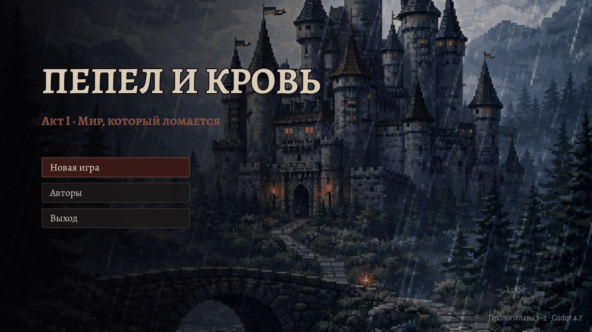
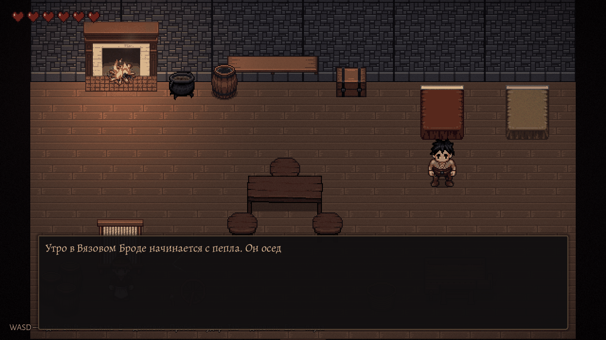
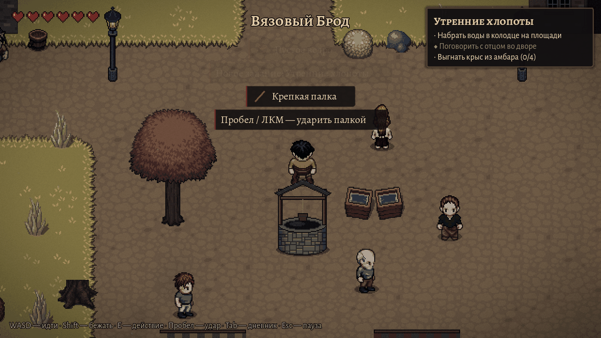
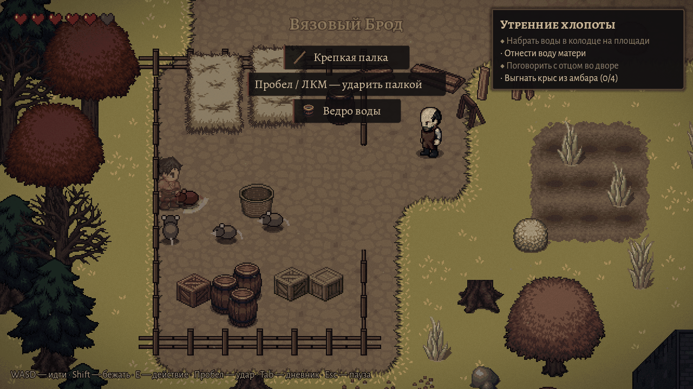
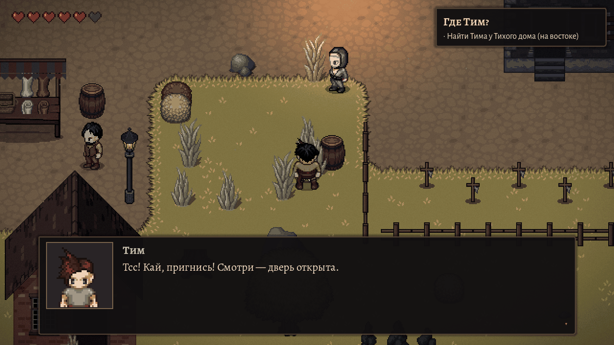
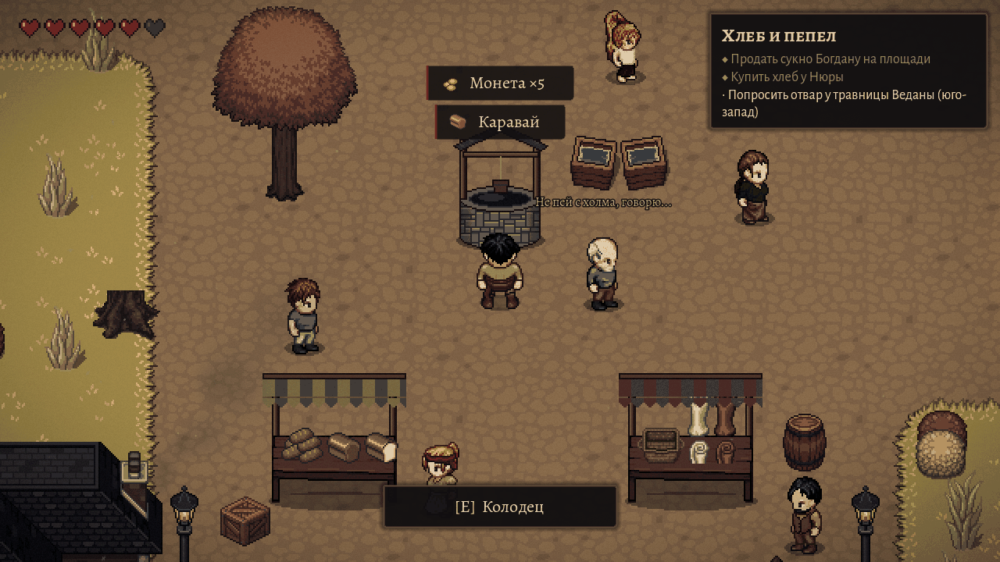
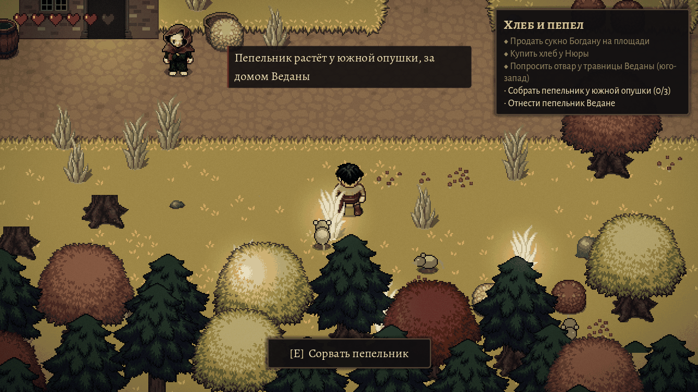
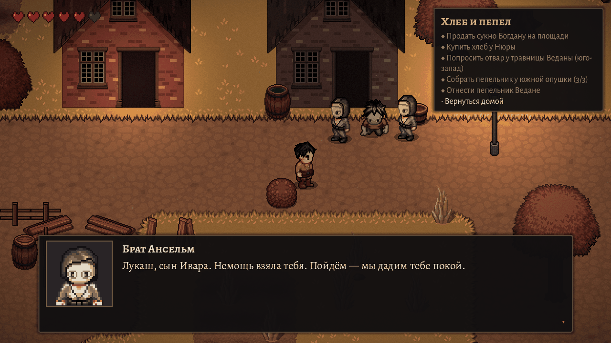
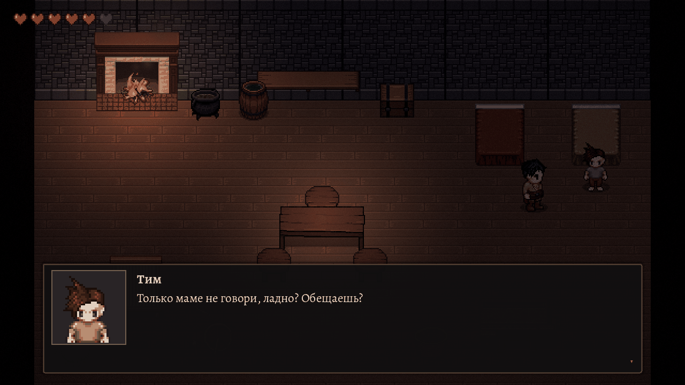

# Пепел и кровь

Мрачная 2D-RPG (вид сверху ¾, пиксель-арт) на **Godot 4.7**.
Сейчас готов пролог: **Акт I «Мир, который ломается», главы 1–2**.



## Как запустить

1. Установите [Godot 4.7+](https://godotengine.org/download) (обычная версия, не .NET).
2. Откройте `project.godot` в редакторе → **F5**.

Управление: **WASD/стрелки** — идти, **Shift** — бежать, **E/Enter** — действие и диалоги,
**Пробел/ЛКМ** — удар палкой, **Tab/Q** — дневник (задания, сумка, герой), **Esc** — пауза.
Поддерживается геймпад. Игра автосохраняется при смене локации («Продолжить» в меню).

## Что внутри

- **Сюжет** глав 1–2: утро в деревне Вязовый Брод, крысы в амбаре, поиски брата у Тихого дома,
  рынок, травница, колокол Серых братьев и ночная развязка. Подробно — [`docs/story.md`](docs/story.md).
- **14 персонажей** с портретами и анимациями, диалоги с выбором ответа, «бормотание» жителей.
- **Задания** с целями и счётчиками, инвентарь и дневник, монеты и торговля.
- **Бой**: удар палкой, отбрасывание, неуязвимость после урона, крысы и «серые» крысы.
- **Атмосфера**: падающий пепел, смена времени суток (утро → день → вечер → ночь), огни фонарей и окон,
  дым из труб и с Тихого холма, цветокоррекция и виньетка, музыка и звуки.
- Титульный экран, карточки глав, меню паузы с громкостью, финальная заставка с тизером Акта II.

## Скриншоты

| | |
|---|---|
|  |  |
|  |  |
|  |  |
|  |  |

## Структура проекта

```
scenes/     сцены: main (титул, игра, финал), world (деревня, дом), actors, ui, props
scripts/    код: actors, components, dialogue, main, ui, world
resources/  данные: диалоги, задания, предметы, персонажи, главы, баланс, звук, тема UI
autoload/   GameState, AudioManager, EventBus
assets/     графика, звук, шрифты (генерируются скриптами из tools/assets)
tools/      пайплайн ассетов (Python) и проверки (tools/ci)
docs/       сюжет, формат диалогов, скриншоты
```

Правила кода и архитектура — в [`CLAUDE.md`](CLAUDE.md). Формат диалогов — [`docs/dialogue_format.md`](docs/dialogue_format.md).

## Проверки

```bash
godot --headless --path . --quit     # быстрая проверка
tools/check.sh                       # загрузка всех ресурсов + бот проходит весь пролог
tools/check.sh --screenshots         # то же с рендером (xvfb) и снимками в docs/screenshots/
```

## Ассеты

Персонажи и окружение — свободный пиксель-арт **Liberated Pixel Cup** (LPC), собранный скриптами:

```bash
python3 tools/assets/build_characters.py   # персонажи из слоёв Universal LPC (+ портреты)
python3 tools/assets/build_environment.py  # тайлы, пропсы, интерьер, иконки, крысы, эффекты
python3 tools/assets/build_audio.py        # процедурные музыка и звуки
python3 tools/assets/build_credits.py      # CREDITS.md по реально использованным файлам
```

Нужны Python 3 + Pillow + numpy; исходники качаются с GitHub и кэшируются в `tools/assets/.cache/`.
Авторы и лицензии — [`CREDITS.md`](CREDITS.md).
